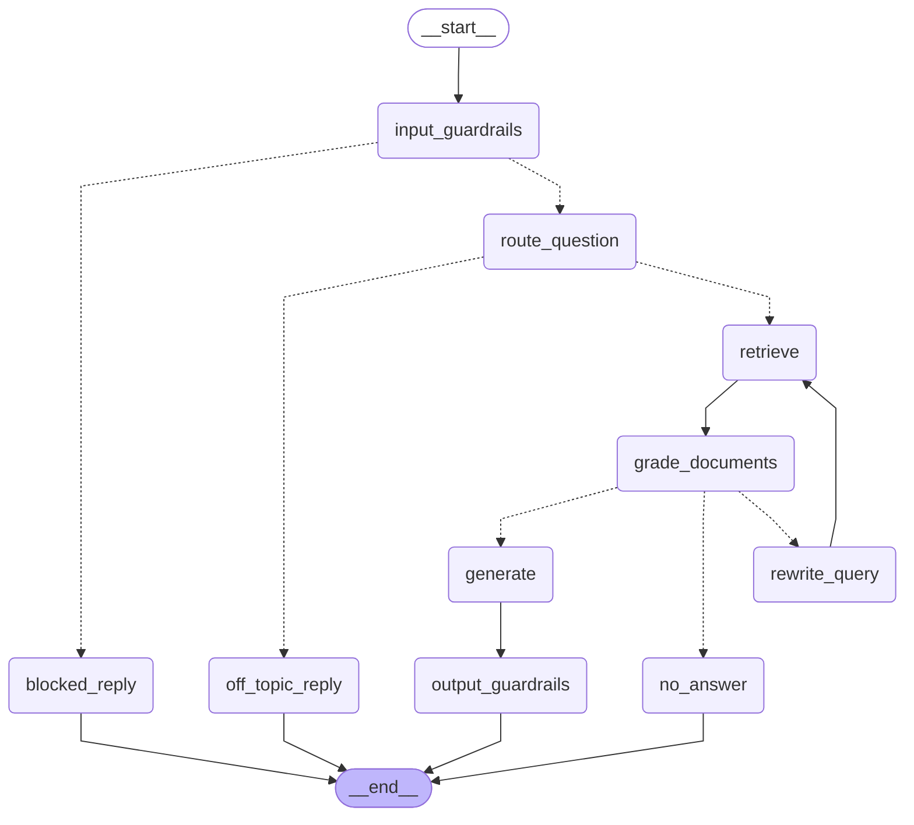

# Runbook Assistant Graph

Generated by `uv run python scripts/draw_graph.py`. Do not edit by hand.

```mermaid
---
config:
  flowchart:
    curve: linear
---
graph TD;
	__start__([<p>__start__</p>]):::first
	input_guardrails(input_guardrails)
	blocked_reply(blocked_reply)
	route_question(route_question)
	off_topic_reply(off_topic_reply)
	retrieve(retrieve)
	grade_documents(grade_documents)
	rewrite_query(rewrite_query)
	generate(generate)
	no_answer(no_answer)
	output_guardrails(output_guardrails)
	__end__([<p>__end__</p>]):::last
	__start__ --> input_guardrails;
	generate --> output_guardrails;
	grade_documents -.-> generate;
	grade_documents -.-> no_answer;
	grade_documents -.-> rewrite_query;
	input_guardrails -.-> blocked_reply;
	input_guardrails -.-> route_question;
	retrieve --> grade_documents;
	rewrite_query --> retrieve;
	route_question -.-> off_topic_reply;
	route_question -.-> retrieve;
	blocked_reply --> __end__;
	no_answer --> __end__;
	off_topic_reply --> __end__;
	output_guardrails --> __end__;
	classDef default fill:#f2f0ff,line-height:1.2
	classDef first fill-opacity:0
	classDef last fill:#bfb6fc
```
